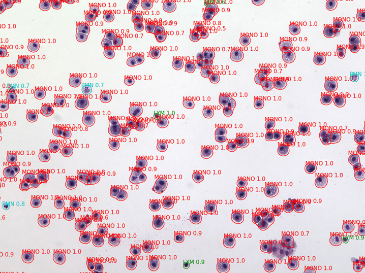

# LungNeuralNet

Mask RCNN was developed by [Kaiming He, 2017](https://arxiv.org/abs/1703.06870) to simultaneously perform instance segmentation, bounding-box object detection, and keypoint detection.

This project was based on the implementation of [matterport](https://github.com/matterport/Mask_RCNN) with additional functionalities:
 - support more convolutional backbone, including vgg and densenet.
 - support large images by performing slicing and merging images & detections.
 - simulate bronchoalveolar lavage from background & representative cell images for efficient training.
 - batch-evaluate models for the mean average precision (mAP).

  
  
After training and validating (3:1) on 21 background image with 26 lymphocytes, 95 monocytes, and 22 polymorphonuclear leukocytes, the neural network is able to detect and categorize these cell types in a mouse lung bronchoalveolar lavage fluid (20X objective).

  
Within one day of training, the accuracy represented by mean average precision has reached 75% for all categories.
The accuracy is highest for the monocyte category.

| CNN Architecture | mAP  |  val_mAP |
|---|---|---|
| DenseNet121 | 0.846 | 0.744 |
| ResNet50 | **0.848** | 0.750 |
| DenseNet121 | 0.838 | **0.763** |

Data credits: Jeanine D'Armiento, Monica Goldklang, Kyle Stearns; Columbia University Medical Center
