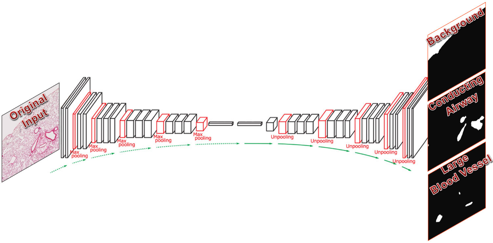

<h1>LungNeuralNet</h1>
We demonstrated that the CNNs, including U-Net and Mask R-CNN, can be instrumental to provide
 i) efficient evaluation of pathological lung lesions;
 ii) detailed characterization of the normal lung histology;
 and iii) precise detection and classification for BALF cells.
 These advanced methods allow improved efficiency and quantification of lung cytology and histopathology.
 
<h2>Applications of U-Net like architectures</h2>

The convolutional neural network architecture was based on U-Net, Convolutional Networks for Biomedical Image Segmentation.
http://lmb.informatik.uni-freiburg.de/people/ronneber/u-net/

<h3>Lung Pathology</h3>
After training on 14 image pairs, the neural network is able to reach >90% accuracy (dice coefficient) in identifying lung parenchymal region and >60% for severe inflammation in the lung in the validation set.
The prediction results on a separate image, including segmentation mask and area stats, was shown below.
<dl>
    <dt>Multi-label overlay (blue: parenchyma, red: severe inflammation)</dd>
</dl>

|   | Parenchyma  |  SevereInflammation |
|---|---|---|
| 36_KO_FLU_1.jpg | 836148 | 203466 |

<h3>Lung Histology</h3>

After training and validating (3:1) on 16 image pairs, the neural network is able to identify a variety of areas in a normal mouse lung section (equivalent to 10X, cropped from whole slide scan).

UNet was modified for larger inputs and to learn both local details (particularly helpful for small blood vessels) and general spatial context (valuable for learning the background). Each label was trained separately into individual neural network with sigmoid output function and loss function with combination of binary crossentropy and dice loss. This will 1) allow each network to function separately, 2) concentrate the computational power on each category, and 3) avoid the imbalance problem that may occur to softmax output and multi-clas crossentropy loss.  
With one day of training, the accuracy as indicated by dice coefficient has reached to more than 80% for most categories. 

><b>single-class (sigmoid) dice coefficient:</b>  
background: 97%  
conducting airway: 84%  
connective tissue: 83%  
large blood vessel: 78%  
respiratory airway: 97%  
small blood vessel: 63%  

Since these categories should constitute 100% of the image and are mutually exclusive, the combined output can be further processed with softmax to select the category/label with the highest probability.

><b>multi-class (softmax) accuracy:</b>  96%

The method can be helpful to identify and quantify various structures or tissue types in the lung and extensible to developmental abnormality or diseased areas.

<dl>
    <dt>Non-Parenchymal Region Highlighted Image</dt>
</dd>

<dl>
    <dt>Six-Color Segmentation Map</dt>    
</dd>

<h2>Applications of Mask R-CNN</h2>

>Kaiming He, Georgia Gkioxari, Piotr Dollár, Ross Girshick. Mask R-CNN. arXiv:1703.06870.  
https://github.com/matterport/Mask_RCNN

MRCNN, based on matterport's implementation, was incorporated and adapted to split/merge tiles from large image, simulate bronchoalveolar lavage from background & representative cell images, and batch-evaluate mean average precisions.

<h3>Broncho-alveolar Lavage Fluid Cytology</h3>

After training and validating (3:1) on 21 background image with 26 lymphocytes, 95 monocytes, and 22 polymorphonuclear leukocytes, the neural network is able to detect and categorize these cell types in a mouse lung bronchoalveolar lavage fluid (20X objective).

  
Within one day of training, the accuracy represented by mean average precision has reached 75% for all categories. The accuracy is highest for the monocyte category. 

<table style="width:100%">
  <tr>
    <th>CNN Architecture</th> 
    <th>mAP</th>
    <th>Val_mAP</th>
  </tr>
  <tr>
    <td>DenseNet121</td>
    <td>0.846</td> 
    <td>0.744</td>
  </tr>
  <tr>
    <td>ResNet50</td>
    <td>0.848</td>
    <td>0.750</td>
  </tr>
  <tr>
    <td>Vgg16</td>
    <td>0.838</td>
    <td>0.763</td>
  </tr>
</table>

Data credits: Jeanine D'Armiento, Monica Goldklang, Kyle Stearns; Columbia University Medical Center
